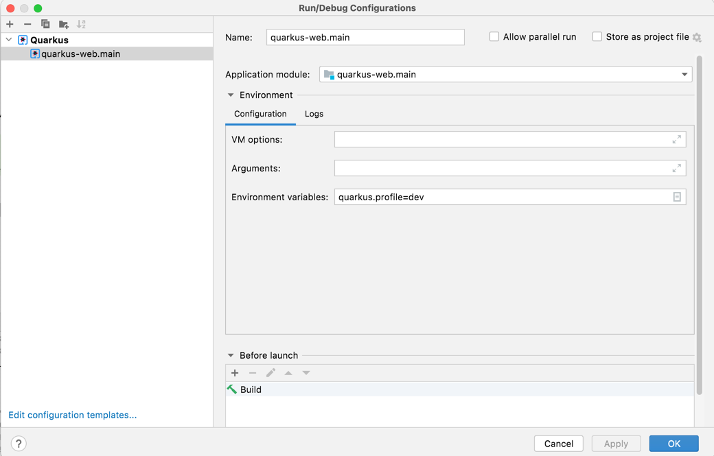

# quarkus-web Project

This was made using [Active Record Pattern](https://en.wikipedia.org/wiki/Active_record_pattern) 

and [Quarkus](https://quarkus.io/)


## Running the application in dev mode

You can run your application in dev mode that enables live coding using:
```shell script
docker-compose up
./gradlew quarkusDev
```

> **_NOTE:_**  Quarkus now ships with a Dev UI, which is available in dev mode only at http://localhost:8080/q/dev/.
> 
Swagger available at http://localhost:8080/q/swagger-ui/ 

To run dev profile (app.yaml) use:


- RESTEasy Reactive [guide](https://quarkus.io/guides/resteasy-reactive), 
- [related guide section...](https://quarkus.io/guides/getting-started-reactive#reactive-jax-rs-resources)
- https://quarkus.io/guides/hibernate-orm
- https://stackoverflow.com/questions/58814922/quarkus-runtime-does-not-inject-entitymanager
- https://quarkus.io/guides/getting-started-reactive
- https://quarkus.io/guides/hibernate-orm-panache
- https://quarkus.io/guides/datasource
- https://www.youtube.com/watch?v=kAui1-4KBrk
- https://quarkus.io/guides/reactive-sql-clients
- https://github.com/quarkusio/quarkus/issues/13425
- https://quarkus.io/guides/spring-web


